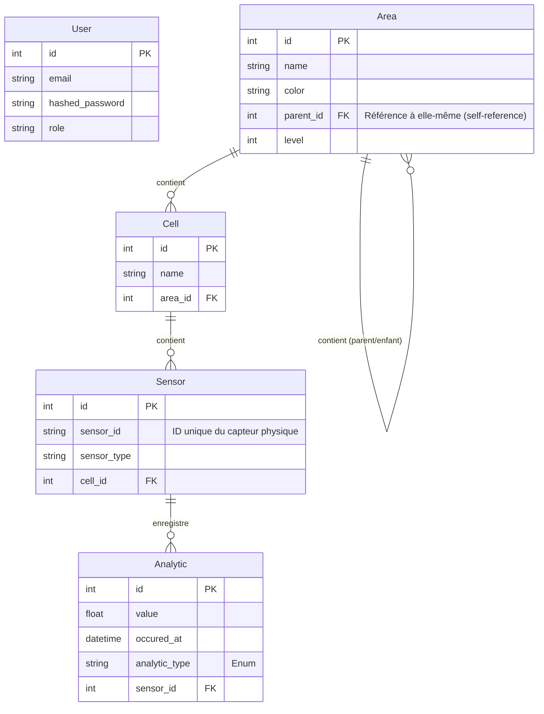

🚀 GardenBack - Le Cœur de JardinConnect
=========================================

> Bienvenue dans le backend de JardinConnect ! 🌱 Ce projet, propulsé par FastAPI, est le moteur qui gère les données de vos jardins connectés, la communication avec les capteurs et l'authentification des utilisateurs.

## 📋 Sommaire
- [✨ Vue d'ensemble](#-vue-densemble)
- [🛠️ Technologies Utilisées](#️-technologies-utilisées)
- [🏁 Pour commencer](#-pour-commencer)
- [🧑‍💻 Workflow de développement](#-workflow-de-développement)
- [ Authentification (JWT)](#-authentification-jwt)
- [📡 Communication MQTT](#-communication-mqtt)
- [️ Schéma de la Base de Données](#-schéma-de-la-base-de-données)
- [🧪 Tests](#-tests)
- [⚙️ Configuration](#️-configuration)
- [❓ Aide](#-aide)

## ✨ Vue d'ensemble

GardenBack est une API RESTful moderne conçue pour être performante, facile à utiliser et à maintenir. Ses responsabilités principales sont :

- **Gestion des Données :** CRUD pour les utilisateurs, les zones de jardin, les cellules et les capteurs.
- **Agrégation d'Analytiques :** Collecte et traitement des données envoyées par les capteurs pour fournir des moyennes et des historiques.
- **Communication en Temps Réel :** Utilisation du protocole MQTT pour recevoir les données des capteurs de manière asynchrone.
- **Authentification Sécurisée :** Système basé sur les tokens JWT pour protéger les routes de l'API.
- **Environnement Isolé :** Entièrement conteneurisé avec Docker pour une mise en place et un déploiement simplifiés.

## 🛠️ Technologies Utilisées

Ce projet s'appuie sur un ensemble d'outils modernes et robustes :

- **[FastAPI](https://fastapi.tiangolo.com/)**: Framework web asynchrone pour construire des API performantes avec une validation de données automatique basée sur les types Python.
- **[SQLAlchemy](https://www.sqlalchemy.org/)**: ORM (Object-Relational Mapper) qui fournit une boîte à outils SQL complète pour interagir avec la base de données de manière pythonique.
- **[Alembic](https://alembic.sqlalchemy.org/)**: Outil de migration de base de données pour SQLAlchemy, permettant de gérer l'évolution du schéma de manière versionnée.
- **[Pydantic](https://docs.pydantic.dev/)**: Bibliothèque de validation de données qui utilise les annotations de type Python pour garantir la conformité des données entrantes et sortantes.
- **[PyJWT](https://pyjwt.readthedocs.io/)**: Pour l'encodage et le décodage des JSON Web Tokens (JWT) utilisés dans le système d'authentification.
- **[Paho-MQTT](https://pypi.org/project/paho-mqtt/)**: Client MQTT pour Python, utilisé pour s'abonner aux topics et recevoir les messages des capteurs.
- **[Docker & Docker Compose](https://www.docker.com/)**: Pour créer des environnements de développement et de production reproductibles et isolés.
- **[Pytest](https://docs.pytest.org/)**: Framework de test pour écrire des tests simples et maintenables.
- **[Makefile](https://www.gnu.org/software/make/)**: Pour automatiser les tâches courantes de développement (installation, tests, gestion des conteneurs, etc.).

## 🏁 Pour commencer

Suivez ces étapes pour lancer le projet pour la première fois.

### 1. Prérequis
Assurez-vous d'avoir installé :
- [Docker](https://www.docker.com/get-started) & Docker Compose
- `make` (généralement préinstallé sur macOS/Linux)

### 2. Installation
```bash
# 1. Clonez le dépôt
git clone git@github.com:JardinConnect/GardenBack.git
cd GardenBack

# 2. Créez votre fichier d'environnement
#    (pas besoin de le modifier pour un démarrage rapide)
cp .env.example .env

# 3. Lancez tout avec une seule commande !
make up-seed
```
Cette commande (`make up-seed`) va :
1.  🗑️ Nettoyer l'ancienne base de données locale (si elle existe).
2.  🏗️ Construire les images Docker.
3.  ⬆️ Appliquer les migrations de la base de données.
4.  🌱 Remplir la base de données avec des données de test (seed).
5.  🚀 Démarrer l'application et les services.

### 3. C'est prêt !
Votre environnement est maintenant en ligne :
- **API & Documentation (Swagger)**: http://localhost:8000/docs
- **Documentation alternative (ReDoc)**: http://localhost:8000/redoc

## 🧑‍💻 Workflow de développement

### Commandes quotidiennes
- **Démarrer** les services : `make up`
- **Arrêter** les services et nettoyer : `make down`
- **Voir les logs** en direct : `docker-compose logs -f fastapi-backend`

### Gestion de la base de données (Migrations)
Quand vous modifiez les modèles dans `db/models.py`, suivez ce processus :
1.  **Générez un nouveau fichier de migration** :
    ```bash
    make generate-migration MESSAGE="Ajout du champ 'is_active' à User"
    ```
2.  **Appliquez la migration**. C'est automatique ! La prochaine fois que vous ferez `make up` ou `make up-seed`, Alembic appliquera les nouvelles migrations.

Pour des opérations plus avancées :
- **Annuler la dernière migration** : `make downgrade`
- **Voir l'historique** : `make history`

## 🗄️ Schéma de la Base de Données
Voici un aperçu de la structure de nos tables.



�🗄️ Gestion de la Base de Données (Alembic)
---

Le projet utilise Alembic pour gérer les migrations de la base de données.

### Générer une migration
`make generate-migration MESSAGE="Ajout de la table utilisateurs"`

### Appliquer les migrations
`make upgrade`

### Annuler la dernière migration
`make downgrade`

### Voir l’historique
`make history`

🧪 Tests
---

### Exécuter les tests :

`make test`


### Exécuter les tests avec couverture :

`make test-coverage`


### Ou directement dans Docker :

`docker-compose exec fastapi-backend python -m pytest`

❓ Aide
---

### Lister toutes les commandes disponibles dans le Makefile :

`make help`

🛠️ Workflow
---

### Exemple 1:  Démarrage initial via commande make

1. Démarrer tous les services
`make up`

    > _tips: si on lance le projet pour la première fois, on peut lancer le projet en 'seedant' la bdd avec la commande `make up-seed`_

---

### Exemple 2: Workflow pour nouvelles migrations (services tournant)

1. Modifier vos modèles dans models.py

2. Générer la migration

`docker-compose --profile tools run --rm db-setup python -m alembic revision --autogenerate -m "Add new field to User"`

3. Appliquer la migration

`docker-compose --profile tools run --rm db-setup python -m alembic upgrade head`

4. Redémarrer FastAPI pour prendre en compte les changements

`docker-compose restart fastapi-backend`


---

### Exemple 3:  Démarrage initial via docker

1. Démarrer tous les services
`docker-compose up --build`

2. Dans un autre terminal, setup initial de la DB

`docker-compose --profile tools run --rm db-setup python -m alembic revision --autogenerate -m "Initial migration"`

`docker-compose --profile tools run --rm db-setup python -m alembic upgrade head`

`docker-compose --profile tools run --rm db-setup python db/seed.py`