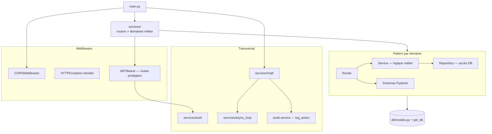

# Architecture applicative — Monolithe modulaire

Le point d'entrée est `main.py`, qui monte tous les routers et démarre MQTT + tâches de fond au lifespan.

Chaque domaine dans `services/` expose ses routes via un `router.py` et suit le pattern **Router → Service → Repository**. Voir [folder-structure.md](./folder-structure.md) pour le détail des modules.
