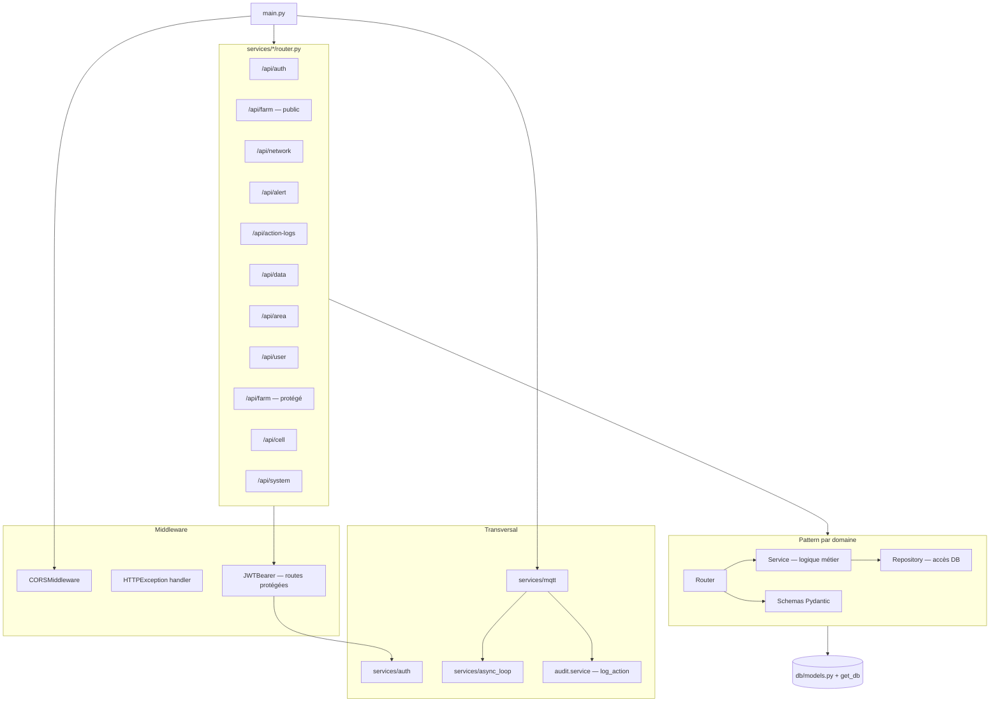

# Architecture applicative — Monolithe modulaire

Le point d'entrée est `main.py`, qui monte tous les routers et démarre MQTT + tâches de fond au lifespan.

## Modules métier

| Module | Rôle | Couches |
|--------|------|---------|
| `auth` | Login, JWT, refresh tokens | router, auth, bearer, dependencies |
| `user` | CRUD utilisateurs | router → service → repository |
| `area` | Zones hiérarchiques (arborescence) | idem |
| `cell` | Cellules + capteurs + pairing | idem |
| `analytics` | Lecture/agrégation des mesures | idem |
| `alerts` | Règles d'alerte + SSE temps réel | service + event_broadcast |
| `audit` | Journal des actions + purge auto | service, purge (background task) |
| `farm_state` | Config ferme (setup public + CRUD) | idem |
| `network` | Wi-Fi via provider abstrait | service → providers |
| `system` | Infos système | router |
| `mqtt` | Client Paho, handlers, pending_acks | client, handlers, subscriber |
