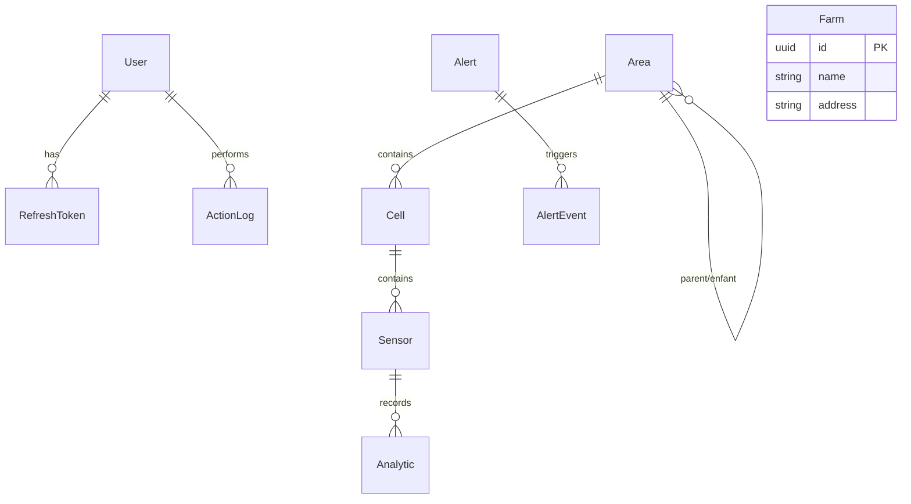

# Couche données — Modèle relationnel

**Stack persistance :**
- **SQLAlchemy** — ORM (`db/models.py`)
- **Alembic** — migrations (`alembic/versions/`)
- **SQLite** — fichier `database.db` (volume `./data`)

