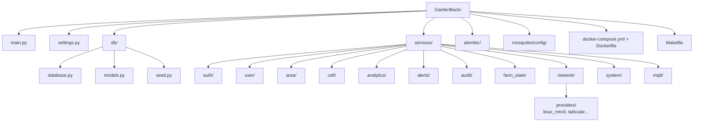

# Structure des dossiers



## Arborescence texte

```
GardenBack/
├── main.py                 # Point d'entrée FastAPI
├── settings.py             # Config (DB, MQTT, Tailscale…)
├── db/
│   ├── database.py         # Engine + SessionLocal + get_db
│   ├── models.py           # Modèles SQLAlchemy
│   └── seed.py             # Données de test
├── services/               # Domaines métier (monolithe modulaire)
│   ├── auth/
│   ├── user/
│   ├── area/
│   ├── cell/
│   ├── analytics/
│   ├── alerts/
│   ├── audit/
│   ├── farm_state/
│   ├── network/
│   │   └── providers/      # linux_nmcli, tailscale…
│   ├── system/
│   └── mqtt/               # Client + handlers MQTT
├── alembic/                # Migrations DB
├── mosquitto/config/       # Broker MQTT
├── docker-compose.yml
├── Dockerfile
└── Makefile                # up, test, migrations…
```
