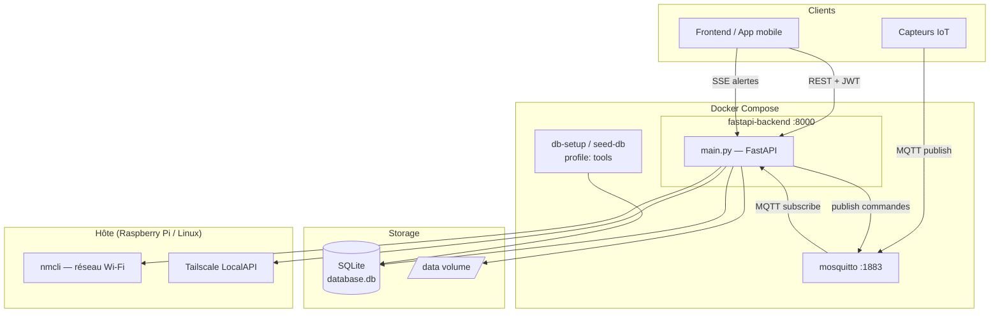

# Vue d'ensemble — Infrastructure

```mermaid
flowchart TB
    subgraph Clients
        FE[Frontend / App mobile]
        DEV[Capteurs IoT]
    end

    subgraph Docker["Docker Compose"]
        subgraph API["fastapi-backend :8000"]
            MAIN[main.py — FastAPI]
        end
        MOSQ[mosquitto :1883]
        TOOLS[db-setup / seed-db<br/>profile: tools]
    end

    subgraph Storage
        SQLITE[(SQLite<br/>database.db)]
        DATA[/data volume/]
    end

    subgraph Host["Hôte (Raspberry Pi / Linux)"]
        NMCLI[nmcli — réseau Wi-Fi]
        TS[Tailscale LocalAPI]
    end

    FE -->|REST + JWT| MAIN
    FE -->|SSE alertes| MAIN
    DEV -->|MQTT publish| MOSQ
    MOSQ -->|MQTT subscribe| MAIN
    MAIN -->|publish commandes| MOSQ
    MAIN --> SQLITE
    MAIN --> DATA
    MAIN --> NMCLI
    MAIN --> TS
    TOOLS --> SQLITE
```
