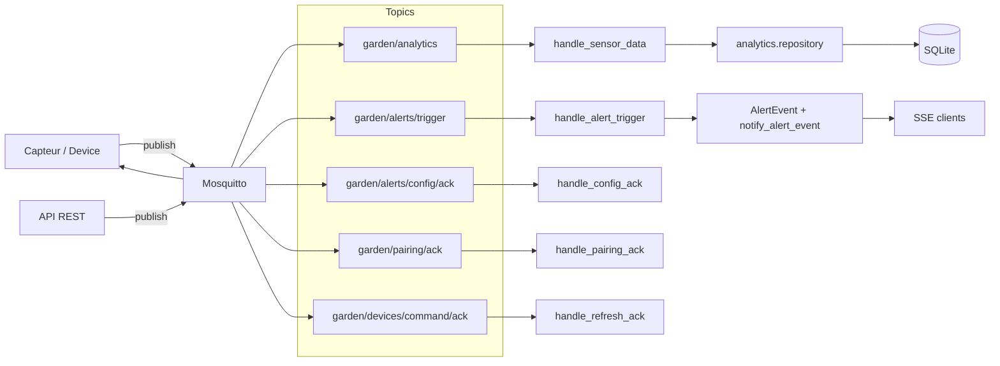

# Flux MQTT (capteurs → backend)

Au démarrage, `main.py` enregistre les handlers et connecte le client MQTT (sauf si `MOCK_MQTT=true`).

```mermaid
flowchart LR
    DEV[Capteur / Device] -->|publish| MOSQ[Mosquitto]

    subgraph Topics
        T1[garden/analytics]
        T2[garden/alerts/trigger]
        T3[garden/alerts/config/ack]
        T4[garden/pairing/ack]
        T5[garden/devices/command/ack]
    end

    MOSQ --> T1 & T2 & T3 & T4 & T5
    T1 --> H1[handle_sensor_data]
    T2 --> H2[handle_alert_trigger]
    T3 --> H3[handle_config_ack]
    T4 --> H4[handle_pairing_ack]
    T5 --> H5[handle_refresh_ack]

    H1 --> AR[analytics.repository]
    H2 --> AE[AlertEvent + notify_alert_event]
    AE --> SSE[SSE clients]
    AR --> DB[(SQLite)]

    API[API REST] -->|publish| MOSQ
    MOSQ --> DEV
```
