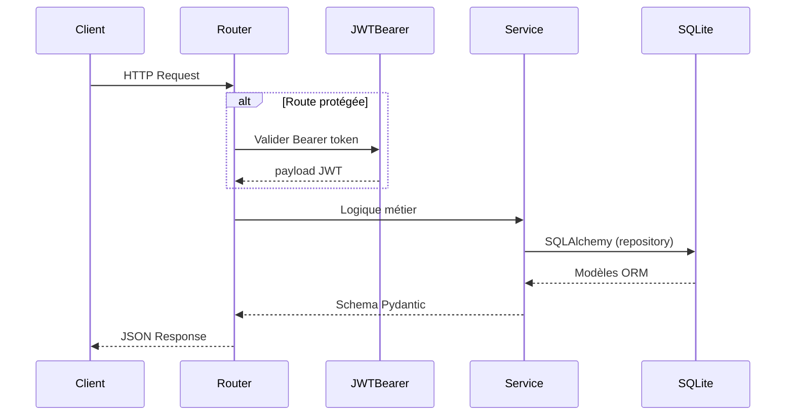

# Flux REST (client → API)

```mermaid
sequenceDiagram
    participant C as Client
    participant R as Router
    participant J as JWTBearer
    participant S as Service
    participant DB as SQLite

    C->>R: HTTP Request
    alt Route protégée
        R->>J: Valider Bearer token
        J-->>R: payload JWT
    end
    R->>S: Logique métier
    S->>DB: SQLAlchemy (repository)
    DB-->>S: Modèles ORM
    S-->>R: Schema Pydantic
    R-->>C: JSON Response
```
