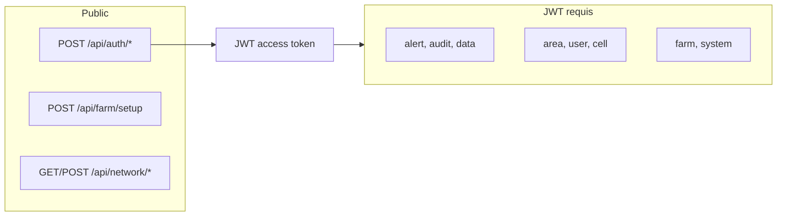

# Sécurité — Routes publiques vs protégées

```mermaid
flowchart LR
    subgraph Public
        A1["POST /api/auth/*"]
        A2["POST /api/farm/setup"]
        A3["GET/POST /api/network/*"]
    end

    subgraph Protected["JWT requis"]
        P1[alert, audit, data]
        P2[area, user, cell]
        P3[farm, system]
    end

    A1 --> TOK[JWT access token]
    TOK --> Protected
```
